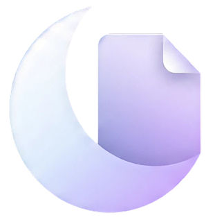

# Soma — Made for night reading

    

Soma is a smooth, rich dark-mode PDF reader built with Svelte 5. Curated themes, crisp text, and colors that stay true — even in the dark.

## About Soma

Reading PDFs at night shouldn't mean blinding white pages or washed-out inverted colors. Soma applies curated color themes directly to PDF rendering so text stays sharp and colors stay faithful — not just a CSS filter slapped on top.

## What You Can Do With Soma

| Feature | What It Does |
|---------|-------------|
| **Curated Dark Themes** | Hand-tuned color palettes that preserve readability and color accuracy — not just "invert white to black" |
| **Drag-and-Drop PDF Loading** | Drop any PDF onto the window and start reading instantly |
| **Thumbnail Navigation** | Sidebar with page thumbnails for quick visual navigation |
| **Keyboard Shortcuts** | Navigate pages, toggle sidebar, zoom, and switch themes without touching the mouse |
| **Persistent Preferences** | Your theme, zoom level, and sidebar state are remembered across sessions via localStorage |

## Dependencies

### Runtime

- [`pdfjs-dist`](https://github.com/niclasberg/pdfjs-dist) — Mozilla's PDF.js for parsing and rendering PDF documents
- [`phosphor-svelte`](https://github.com/haruaki07/phosphor-svelte) — Icon library

### Development

- [Svelte 5](https://svelte.dev) — UI framework with runes reactivity
- [Vite 6](https://vite.dev) — Build tool and dev server
- [TypeScript 5](https://www.typescriptlang.org) — Type safety
- [Vitest](https://vitest.dev) — Test runner

### Getting Started

```bash
bun install
bun dev
```

Open `http://localhost:5173` and drop a PDF.

## Implementation Details

### Rendering Pipeline

Soma uses a custom rendering bridge (`doq-bridge`) that sits between PDF.js and the canvas. When a theme is active, the bridge intercepts PDF drawing operations and remaps colors before they hit the canvas — so you get true themed rendering, not a post-process filter.

### Architecture

```
src/
├── components/       # Svelte 5 components (App, Sidebar, PageView, etc.)
├── lib/
│   ├── doq/          # Color-remapping engine (annotations, color math, drawing ops)
│   ├── pdf/          # PDF loading, rendering, thumbnails, scroll utilities
│   ├── stores/       # Svelte 5 rune-based state (UI prefs, PDF document state)
│   ├── persist.ts    # localStorage persistence
│   ├── keyboard.ts   # Keyboard shortcut bindings
│   └── doq-bridge.ts # Bridge between PDF.js and the doq color engine
└── types.ts          # Shared TypeScript types
```

### Key Design Decisions

- **Canvas rendering over DOM** — PDF pages render to `<canvas>` for pixel-perfect output and theme color accuracy
- **No server, no service worker** — Pure static SPA; deploy anywhere that serves HTML
- **Rune-based stores** — Svelte 5 runes (`$state`, `$derived`) for reactive state instead of classic stores
